# Uas-TCC

## Docker for Beginners - Linux

kita akan melihat beberapa perintah Docker dasar dan alur kerja build-ship-run sederhana. Kami akan mulai dengan menjalankan beberapa wadah sederhana, lalu kami akan menggunakan Dockerfile untuk membangun aplikasi khusus. Terakhir, kita akan melihat cara menggunakan bind mounts untuk memodifikasi wadah yang sedang berjalan seperti yang Anda lakukan jika Anda secara aktif mengembangkan menggunakan Docker.

### Prasyarat

Anda akan membutuhkan semua yang berikut untuk menyelesaikan lab ini:

     Klon dari repo GitHub laboratorium.
     DockerID.

#### Clone the GitHub Repo Lab

Gunakan perintah berikut untuk mengkloning repo lab dari GitHub (Anda dapat mengklik perintah atau mengetiknya secara manual). Ini akan membuat salinan repo laboratorium di sub-direktori baru bernama linux_tweet_app.

     **git clone https://github.com/dockersamples/linux_tweet_app**

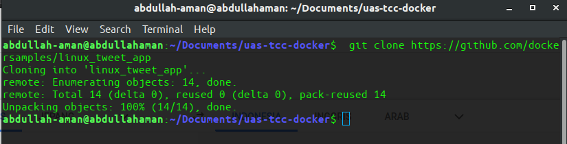

#### Pastikan Anda memiliki DockerID

Jika Anda tidak memiliki DockerID (login gratis yang digunakan untuk mengakses Docker Hub), silakan kunjungi Docker Hub dan mendaftar untuk itu. Anda akan membutuhkan ini untuk langkah selanjutnya.

### Jalankan beberapa wadah Docker sederhana

Ada berbagai cara untuk menggunakan wadah. Ini termasuk:

     1. Untuk menjalankan satu tugas: Ini bisa berupa skrip shell atau aplikasi khusus.
     2. Interaktif: Ini menghubungkan Anda ke wadah yang mirip dengan cara Anda SSH ke server jauh.
     3. Di latar belakang: Untuk layanan jangka panjang seperti situs web dan basis data.

Di bagian ini Anda akan mencoba masing-masing opsi tersebut dan melihat bagaimana Docker mengelola beban kerja.

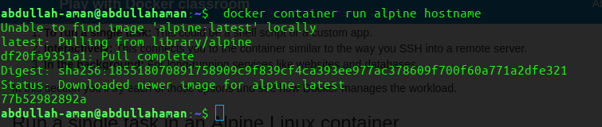
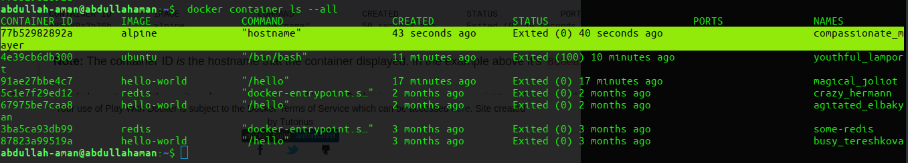
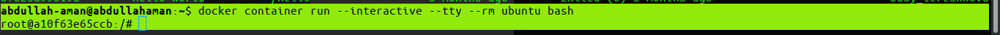
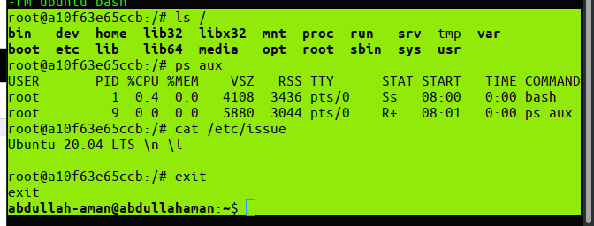
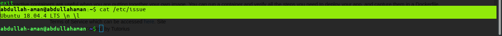
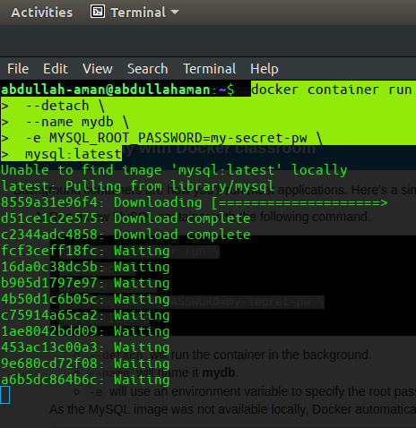
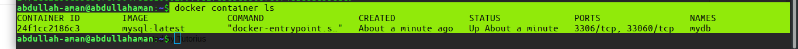
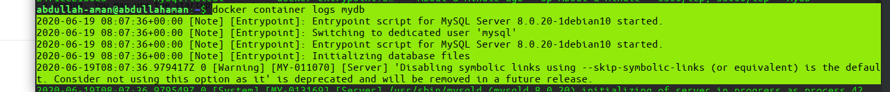
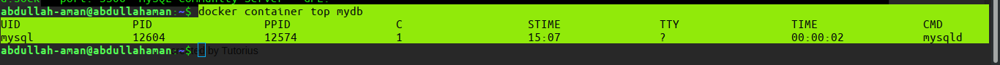
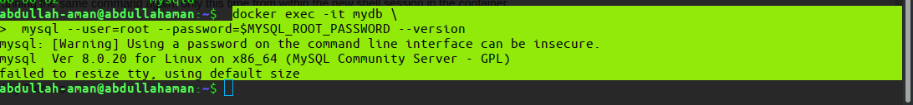
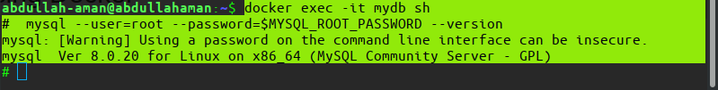
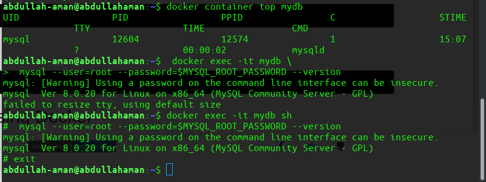

### Paket dan jalankan aplikasi khusus menggunakan Docker

Pada langkah ini Anda akan belajar cara mengemas aplikasi Anda sendiri sebagai gambar Docker menggunakan Dockerfile.

Sintaks Dockerfile sangat mudah. Dalam tugas ini, kami akan membuat situs web NGINX sederhana dari Dockerfile.

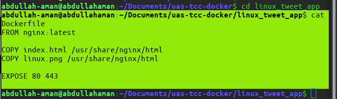
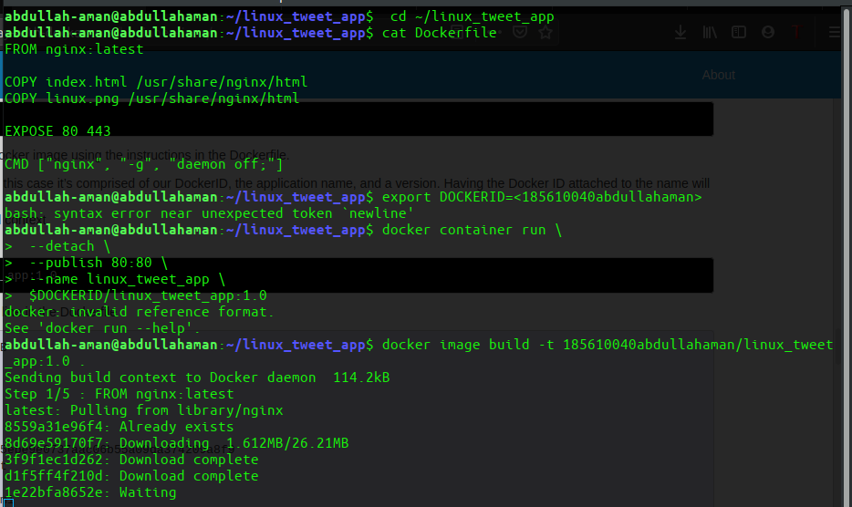
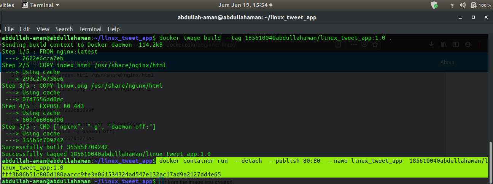
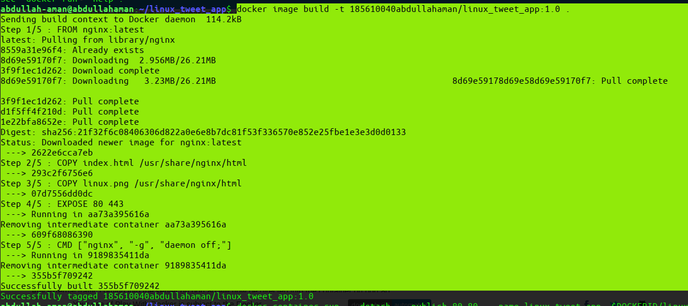
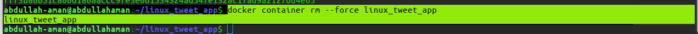
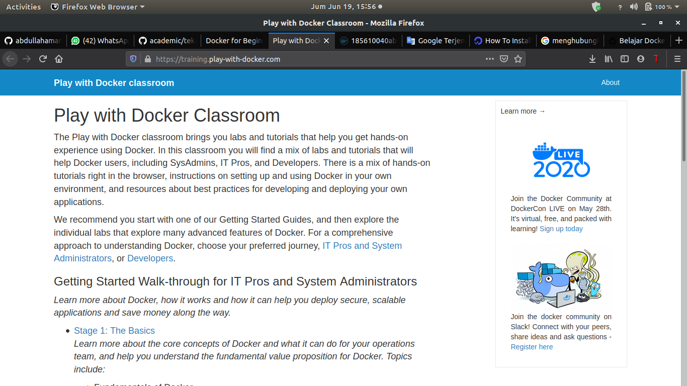
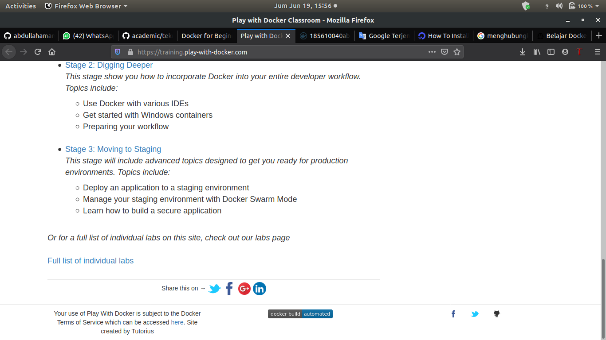

### Ubah situs web yang berjalan

Saat Anda bekerja secara aktif pada aplikasi, tidak nyaman harus menghentikan wadah, membangun kembali gambar, dan menjalankan versi baru setiap kali Anda membuat perubahan pada kode sumber Anda.

Salah satu cara untuk merampingkan proses ini adalah dengan memasang direktori kode sumber pada mesin lokal ke wadah yang sedang berjalan. Ini akan memungkinkan setiap perubahan yang dibuat pada file pada host untuk segera tercermin dalam wadah.

Kami melakukan ini menggunakan sesuatu yang disebut bind mount.

Saat Anda menggunakan bind mount, file atau direktori pada mesin host dipasang ke sebuah wadah yang berjalan di host yang sama.

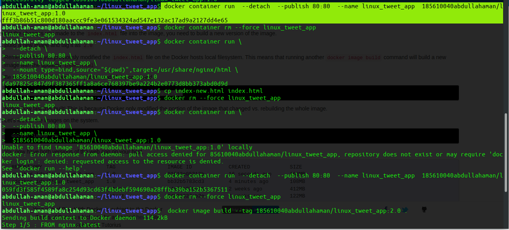
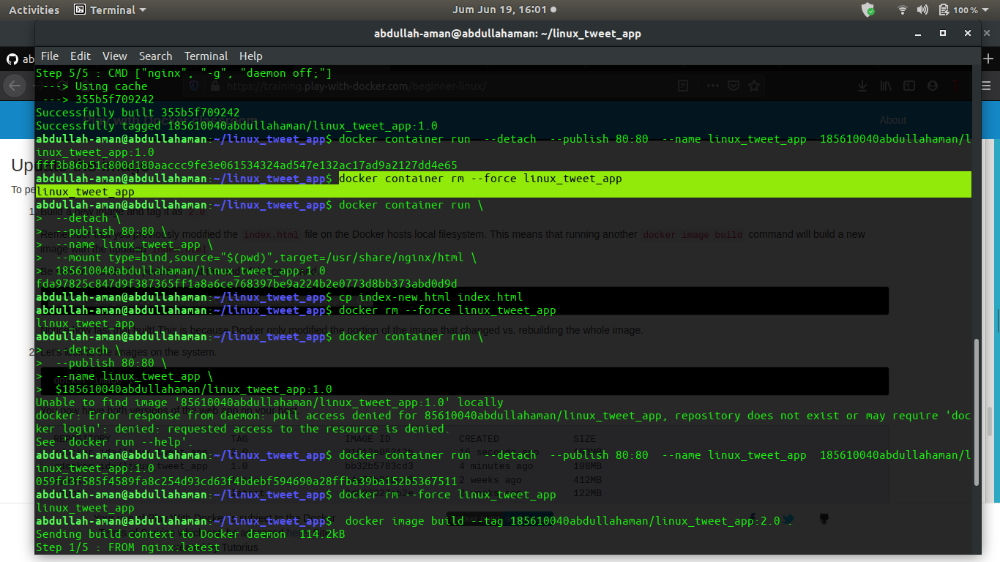
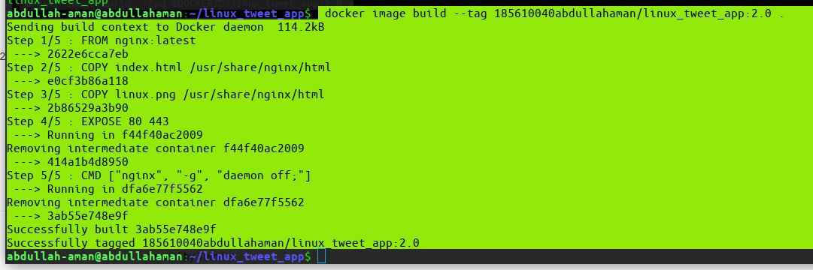
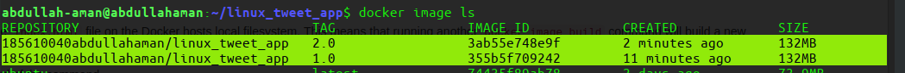
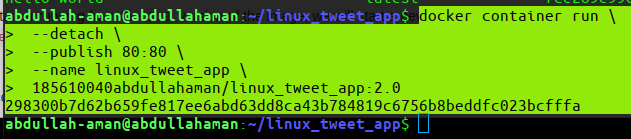
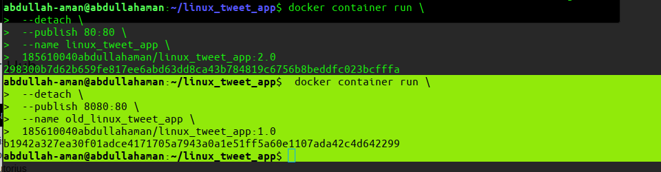
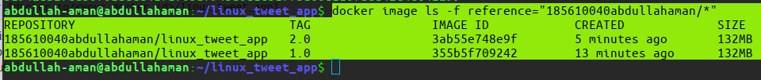
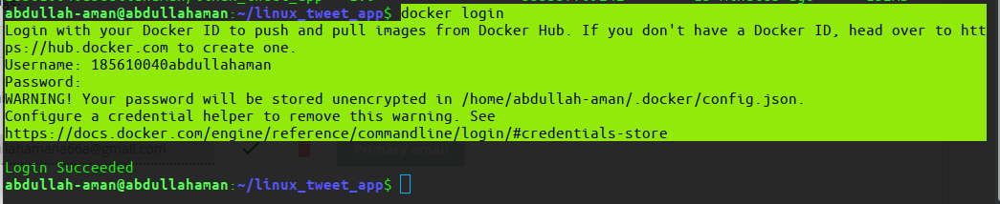
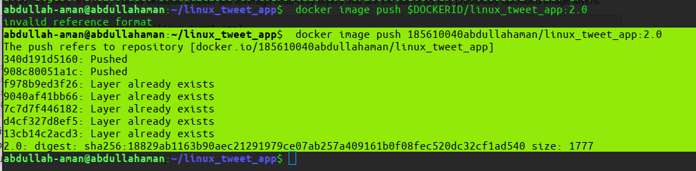

