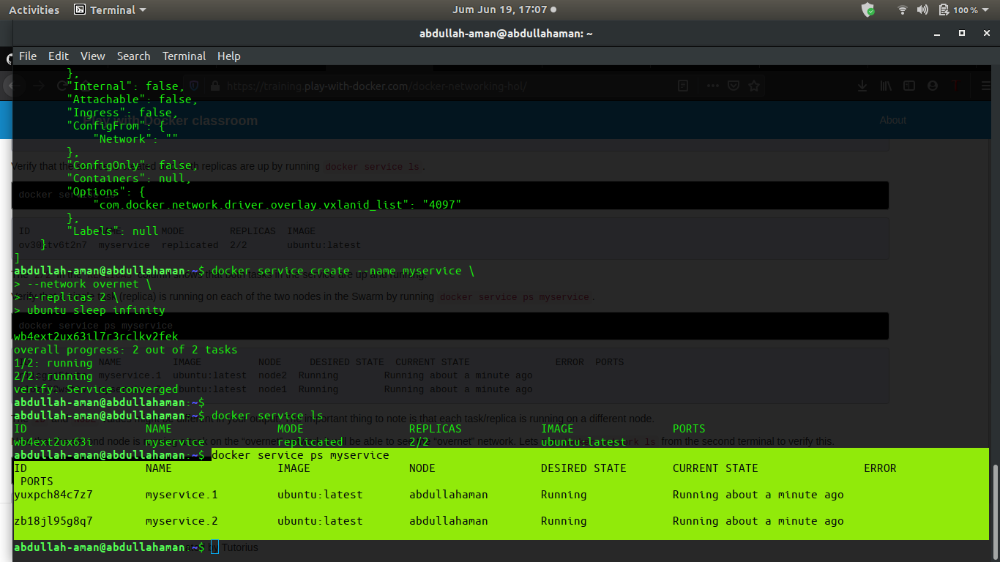

# Uas-TCC

## Docker Networking Hands-on Lab

pelajari tentang konsep utama Docker Networking. Anda akan mendapatkan tangan Anda kotor dengan melihat contoh-contoh beberapa konsep jaringan dasar, belajar tentang jaringan Bridge, dan akhirnya Overlay networking.

### Dasar-Dasar Jaringan

### Jembatan Jaringan

### Overlay Networking

