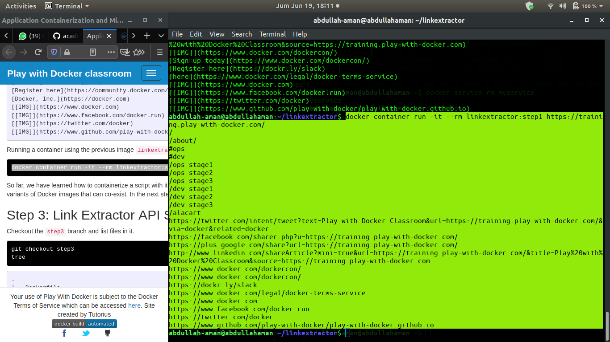

# Uas-TCC

## Application Containerization and Microservice Orchestration

kita akan belajar tentang kontainerisasi aplikasi dasar menggunakan Docker dan menjalankan berbagai komponen aplikasi sebagai layanan microser. Kami akan menggunakan Docker Compose untuk orkestrasi selama pengembangan. Tutorial ini ditargetkan untuk pemula yang memiliki pengetahuan dasar dengan Docker. Jika Anda baru menggunakan Docker, kami sarankan Anda untuk memeriksa tutorial Docker untuk Pemula terlebih dahulu.

Kami akan mulai dari skrip Python dasar yang mengikis tautan dari laman web tertentu dan secara bertahap mengubahnya menjadi tumpukan aplikasi multi-layanan. Kode demo tersedia di repo Link Extractor. Kode ini disusun dalam langkah-langkah yang secara bertahap memperkenalkan perubahan dan konsep baru. Setelah selesai, tumpukan aplikasi akan berisi layanan microser berikut:

    Aplikasi web yang ditulis dalam PHP dan disajikan menggunakan Apache yang mengambil URL sebagai input dan merangkum tautan yang diekstrak darinya
    Aplikasi web berbicara ke server API yang ditulis dengan Python (dan Ruby) yang menangani ekstraksi tautan dan mengembalikan respons JSON
    Cache Redis yang digunakan oleh server API untuk menghindari pengambilan berulang dan ekstraksi tautan untuk halaman yang sudah dikikis

Tutorial ini pada awalnya dikembangkan untuk kolokium di Departemen Ilmu Komputer dari Old Dominion University, Norfolk, Virginia. Rekaman video, slide presentasi, dan deskripsi singkat tentang ceramah dapat ditemukan di posting blog.

     Langkah:

         Pengaturan Panggung
         Langkah 0: Skrip Extractor Tautan Dasar
         Langkah 1: Script Extractor Tautan Kontainer
         Langkah 2: Tautkan Modul Extractor dengan URI Penuh dan AnchorText
         Langkah 3: Layanan Link Extractor API
         Langkah 4: Link Extractor API dan Layanan Front Web
         Langkah 5: Layanan Redis untuk Caching
         Langkah 6: Tukar Layanan API Python dengan Ruby

Kesimpulan

Kami memulai tutorial ini dengan skrip Python sederhana yang mengikis tautan dari URL laman web pemberian. Kami menunjukkan berbagai kesulitan dalam menjalankan skrip. Kami kemudian mengilustrasikan betapa mudahnya menjalankan dan membuat skrip menjadi mudah dibawa kemas. Pada langkah selanjutnya kami secara bertahap mengembangkan skrip menjadi tumpukan aplikasi multi-layanan. Dalam proses tersebut kami mengeksplorasi berbagai konsep arsitektur layanan mikro dan bagaimana alat Docker dapat membantu dalam menyusun tumpukan multi-layanan. Akhirnya, kami mendemonstrasikan kemudahan pertukaran komponen layanan mikro dan kegigihan data.
